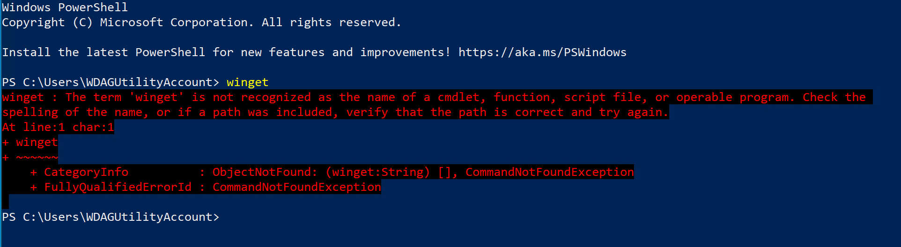
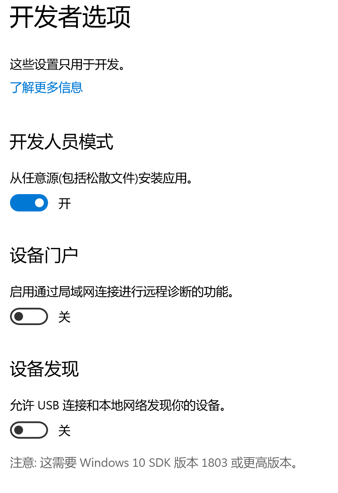
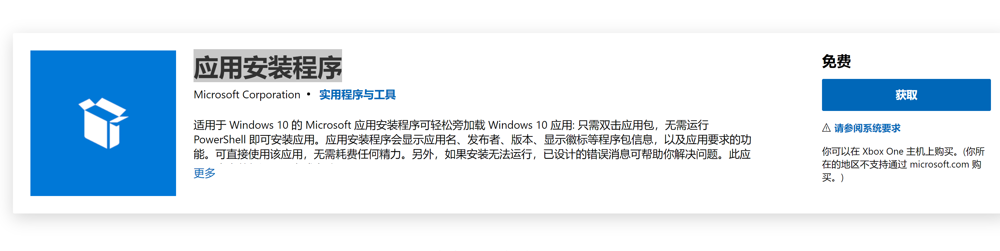

如在下载软件后有使用问题，`善用搜索功能，按Ctrl+F搜索`，或提交issue。

------


<h1 align="center">目录</h1>

**按Ctrl+F搜索以下目录内容信息**

1、Windows生产力提升（linux化）

2、burpsuite2021.5.1使用方法


------


<h1 align="center">Windows生产力提升（linux化）</h1>


习惯使用Linux，并且平成使用时需要使用Linux环境时，我们往往下载一个虚拟机，安装Ubuntu等的Linux系统才能使用。以下是如何在一台Windows电脑上使用日常开发的所需的Linux环境以及类似工具的方法。


## 🛒 **winget使用方法**

>打开powershell，尝试输入winget 命令，此时会报错，如下。



``` shell
C:\Users\WDAGUtilityAccount> winget
winget : The term 'winget' is not recognized as the name of a cmdlet, function, script file, or operable program. Check the spelling of the name, or if a path was
included, verify that the path is correct and try again.
At line:1 char:1
+ winget
+ ~~~~~~
    + CategoryInfo          : ObjectNotFound: (winget:String) [], CommandNotFoundException
    + FullyQualifiedErrorId : CommandNotFoundException
```


### 打开功能

> 1、找到设置>>更新和安全>>开发者选项





> 打开开发者模式中的从任意源安装应用，次任意源和linux 的源文件类似，都利用源进行检索，然后下载安装。

> 点击[**winget**](https://www.microsoft.com/zh-cn/p/app-installer/9nblggh4nns1?ocid=9nblggh4nns1_ORSEARCH_Bing&rtc=2&activetab=pivot:overviewtab)链接，安装“应用安装程序”软件。





>适用于 Windows 10 的 Microsoft 应用安装程序可轻松旁加载 Windows 10 应用: 只需双击应用包，无需运行 PowerShell 即可安装应用。应用安装程序会显示应用名、发布者、版本、显示徽标等程序包信息，以及应用要求的功能。可直接使用该应用，无需耗费任何精力。另外，如果安装无法运行，已设计的错误消息可帮助你解决问题。此应用程序当前仅适用于台式电脑。


>安装 **应用安装程序** 后，可以通过在命令提示符下键入“winget”来运行 **winget**。

```bash
Windows Package Manager v0.3.11102 预览
版权所有 (C) Microsoft Corporation。保留所有权利。

WinGet 命令行实用工具可从命令行安装应用程序和其他程序包。

使用情况: winget [<命令>] [<选项>]

下列命令有效:
  install   安装给定的程序包
  show      显示有关程序包的信息
  source    管理程序包的来源
  search    查找并显示程序包的基本信息
  hash      哈希安装程序的帮助程序
  validate  验证清单文件
  settings  打开设置
  features  显示实验性功能的状态
  import    安装文件中的所有程序包

如需特定命令的更多详细信息，请向其传递帮助参数。 [-?]

下列选项可用：
  -v,--version  显示工具的版本
  --info        显示工具的常规信息

可在此找到更多帮助： https://aka.ms/winget-command-help


```

>若要[搜索](https://docs.microsoft.com/zh-cn/windows/package-manager/winget/search)某个工具，请键入 `winget search <appname>`。注：要保证本地网络到源服务地址联通性。


```bash
C:\Users\user> winget search 11
名称                           ID                            版本        匹配
---------------------------------------------------------------------------------------
Microsoft OpenJDK 11 (Preview) Microsoft.OpenJDK.11          11.0.11.9   Tag: 11
Fluent Reader                  yang991178.fluent-reader      1.0.0
Citycraft Launcher             Simon511000.CitycraftLauncher 1.9.9
Liberica JDK 11 Full           BellSoft.LibericaJDK11Full    11.0.11.9
Liberica JDK 11                BellSoft.LibericaJDK11        11.0.11.9
Corretto                       Amazon.Corretto.11            11.0.10.9.1
AdoptOpenJDK 11.0.10+9 (x64)   AdoptOpenJDK.OpenJDK.11       11.0.10
ojdkbuild 14.0.1-1 (x64)       ojdkbuild.ojdkbuild           14.0.1-1
x2goclient                     X2go.x2goclient               4.1.2.2     Tag: x11
Xming                          colinharrison.xming           6.9.0.31    Tag: x11server

```


>2.确认你需要的工具可用后，可以通过键入 `winget install <appname>` 来[安装](https://docs.microsoft.com/zh-cn/windows/package-manager/winget/install)该工具。 **winget** 工具会启动安装程序，将应用程序安装在你的电脑上，下载速度取决于本地网络，如一直加载，说明本地网络无法到达源服务器。（点击下载链接，可以直接下载软件。）


```bash
PS C:\Users\yang> winget install nmap
已找到 Nmap [Insecure.Nmap]
此应用程序由其所有者授权给你。
Microsoft 对第三方程序包概不负责，也不向第三方程序包授予任何许可证。
Downloading https://nmap.org/dist/nmap-7.80-setup.exe
  ██████████████████████████████  25.6 MB / 25.6 MB
已成功验证安装程序哈希
正在启动程序包安装...
```


>至此，我们可以在这条电脑上使用了类似yum功能的安装程序。


## 📑 应用简介

在原有协议[LICENSE](https://github.com/zhzyker/vulmap/blob/main/LICENSE)中追加以下免责声明。若与原有协议冲突均以免责声明为准。  

本工具禁止进行未授权商业用途，禁止二次开发后进行未授权商业用途。  

本工具仅面向合法授权的企业安全建设行为，在使用本工具进行检测时，您应确保该行为符合当地的法律法规，并且已经取得了足够的授权。  

如您在使用本工具的过程中存在任何非法行为，您需自行承担相应后果，我们将不承担任何法律及连带责任。 

在使用本工具前，请您务必审慎阅读、充分理解各条款内容，限制、免责条款或者其他涉及您重大权益的条款可能会以加粗、加下划线等形式提示您重点注意。 除非您已充分阅读、完全理解并接受本协议所有条款，否则，请您不要使用本工具。您的使用行为或者您以其他任何明示或者默示方式表示接受本协议的，即视为您已阅读并同意本协议的约束。  


## 📺 Video demo

> 哔哩哔哩 链接上传中


## 🙋 Discussion


[阳子饭]([阳子饭 – Just another WordPress site (yangzi.fun)](https://yangzi.fun/))

## 🔧 Options

``` 
可选参数:
  install   安装给定的程序包
  show      显示有关程序包的信息
  source    管理程序包的来源
  search    查找并显示程序包的基本信息
  hash      哈希安装程序的帮助程序
  validate  验证清单文件
  settings  打开设置
  features  显示实验性功能的状态
  import    安装文件中的所有程序包
  -v,--version  显示工具的版本
  --info        显示工具的常规信息
```

## 🐾 参考

[使用 winget 工具安装和管理应用程序 | Microsoft Docs](https://docs.microsoft.com/zh-cn/windows/package-manager/winget/)


------


<h1 align="center">burpsuite2021.5.1使用方法</h1>

#### BurpSuite2021.5.1 sha256校验码：

```
burpsuite_pro_v2021.5.1.jar:

sha256:
be9f30043cb6ca7c8dbb3b183dab89fc112641cbfaa804dd44c7e2a46ad60098

md5:
4ad0d0b2016506a50dcf3101e647823c
```

#### 安装方法：

①java版本≥9 , **推荐使用java13**.
②设置环境变量
③激活方式自行查看往期文章(搜索burp)
④运行ddosi.bat.
⑤然后双击burploader-old.jar


